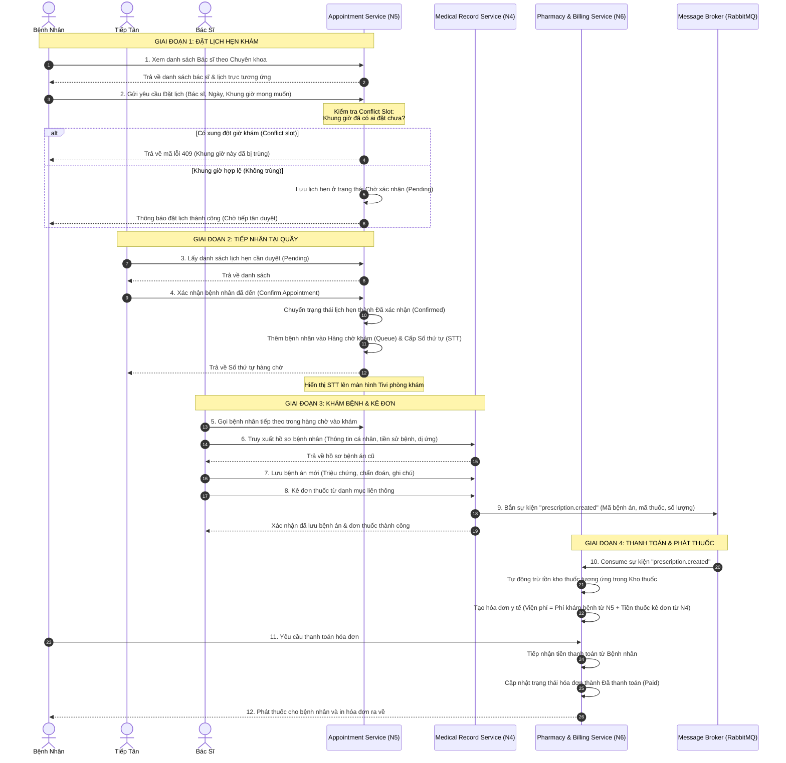

# Luồng Hoạt Động Liên Thông Giữa 3 Dịch Vụ Microservices

Tài liệu này mô tả chi tiết luồng hoạt động nghiệp vụ y tế khép kín được phân chia và xử lý bởi 3 dịch vụ độc lập (Microservices) của 3 nhóm phát triển.

---

## 1. Bản Đồ Trách Nhiệm Của Các Nhóm

| Dịch vụ | Vai trò phát triển | Nhiệm vụ chính | Cơ sở dữ liệu |
| :--- | :--- | :--- | :--- |
| **Appointment Service** (Nhóm 5) | Quản lý đặt lịch và phân luồng | - Quản lý hồ sơ bác sĩ, lịch trực, chuyên khoa, phí khám.<br>- Đặt lịch khám phía Bệnh nhân (chọn Chuyên khoa -> Bác sĩ -> Giờ trống).<br>- Phát hiện trùng giờ khám (Conflict slot).<br>- Tiếp tân duyệt lịch hẹn và cấp Số thứ tự (STT) vào Hàng chờ (Queue). | `AppointmentDB` |
| **Medical Record Service** (Nhóm 4) | Quản lý khám bệnh và hồ sơ | - Quản lý thông tin hành chính, tiền sử bệnh án, dị ứng của Bệnh nhân.<br>- Bác sĩ ghi nhận triệu chứng, chẩn đoán bệnh án.<br>- Kê đơn thuốc từ danh mục thuốc liên thông.<br>- Phát đi sự kiện (Publish event) `prescription.created` sau khi hoàn thành. | `MedicalDB` |
| **Pharmacy & Billing Service** (Nhóm 6) | Quản lý thanh toán và kho thuốc | - Xác thực tập trung (JWT login), quản lý tài khoản cho cả 4 vai trò.<br>- Quản lý kho thuốc (Nhập thuốc, cập nhật giá, tồn kho).<br>- Nhận sự kiện (Consume event) `prescription.created` để tự động trừ kho thuốc.<br>- Tính toán và thu viện phí (Phí khám + Tiền thuốc). | `PharmacyDB` |

---

## 2. Sơ Đồ Quy Trình Hoạt Động Liên Thông (Sequence Diagram)

Sơ đồ dưới đây thể hiện cách các dịch vụ tương tác với nhau từ lúc Bệnh nhân bắt đầu đặt lịch cho đến khi ra về:



---

## 3. Mô Tả Chi Tiết Kịch Bản Nghiệp Vụ

### Bước 1: Đăng nhập hệ thống (Pharmacy & Billing Service - Nhóm 6)
* Người dùng sử dụng tài khoản được quản lý bởi Dịch vụ Nhóm 6 để đăng nhập.
* Dịch vụ Nhóm 6 trả về một **JWT Token** chứa thông tin định danh và vai trò truy cập (`Admin`, `Doctor`, `Receptionist`, `Patient`).
* Token này sẽ được gắn kèm vào tiêu đề (Header) `Authorization: Bearer <token>` trong các yêu cầu gọi API tiếp theo đến API Gateway.

### Bước 2: Đặt lịch và giải quyết xung đột giờ khám (Appointment Service - Nhóm 5)
* Bệnh nhân truy cập ứng dụng, thực hiện chọn Chuyên khoa và Bác sĩ.
* Hệ thống hiển thị các khung giờ làm việc còn trống dựa trên lịch trực của bác sĩ đó.
* Khi bệnh nhân gửi yêu cầu đặt lịch, Dịch vụ Nhóm 5 thực hiện truy vấn cơ sở dữ liệu:
  ```sql
  SELECT COUNT(*) FROM Appointments 
  WHERE DoctorId = @DoctorId 
    AND AppointmentDate = @AppointmentDate 
    AND AppointmentTime = @AppointmentTime
    AND Status != 'Cancelled'
  ```
* **Phát hiện trùng giờ (Conflict slot):**
  * Nếu kết quả trả về `> 0`, hệ thống trả lỗi ngay lập tức về phía giao diện người dùng nhằm ngăn chặn việc hai bệnh nhân cùng đặt chung một khung giờ với cùng một bác sĩ.
  * Nếu kết quả trả về bằng `0`, hệ thống lưu lịch hẹn ở trạng thái `Pending` (Chờ xác nhận).

### Bước 3: Đón tiếp và xếp hàng chờ (Appointment Service - Nhóm 5)
* Khi bệnh nhân đến phòng khám, Tiếp tân kiểm tra thông tin và nhấn **Xác nhận**.
* Lịch hẹn được cập nhật trạng thái từ `Pending` thành `Confirmed`.
* Đồng thời, hệ thống thêm một bản ghi vào bảng hàng chờ của bác sĩ đó:
  ```json
  {
    "appointmentId": 12,
    "doctorId": 3,
    "patientName": "Nguyễn Văn A",
    "queueNumber": 5,
    "status": "Waiting"
  }
  ```
* Màn hình Tivi phòng khám hiển thị số thứ tự y tế liên tục cập nhật theo thời gian thực để bệnh nhân tiện theo dõi.

### Bước 4: Khám bệnh và phát hành sự kiện đơn thuốc (Medical Record Service - Nhóm 4)
* Bác sĩ mở màn hình khám bệnh, xem thông tin hành chính, tiền sử bệnh án cũ, và các thông tin dị ứng từ dữ liệu do Dịch vụ Nhóm 4 quản lý.
* Sau khi thăm khám trực tiếp, bác sĩ nhập dữ liệu bệnh án mới và tiến hành kê đơn thuốc.
* Khi đơn thuốc được lưu thành công, Dịch vụ Nhóm 4 sẽ phát đi sự kiện `prescription.created` đến Message Broker (ví dụ RabbitMQ hoặc Kafka).
  
  **Nội dung Event Message mẫu (`prescription.created`):**
  ```json
  {
    "eventId": "evt_987654321",
    "prescriptionId": 45,
    "appointmentId": 12,
    "patientPhone": "0912345678",
    "doctorFee": 150000.0,
    "medicines": [
      {
        "medicineId": 101,
        "medicineName": "Paracetamol 500mg",
        "quantity": 10,
        "price": 2000.0
      },
      {
        "medicineId": 102,
        "medicineName": "Amoxicillin 500mg",
        "quantity": 20,
        "price": 5000.0
      }
    ],
    "createdAt": "2026-06-22T08:45:00Z"
  }
  ```

### Bước 5: Tiếp nhận đơn thuốc, xuất kho và thu tiền (Pharmacy & Billing Service - Nhóm 6)
* Dịch vụ Nhóm 6 lắng nghe sự kiện `prescription.created` từ hàng đợi chung.
* Ngay khi nhận được thông điệp:
  * **Trừ kho thuốc:** Hệ thống tự động trừ tồn kho của Paracetamol đi 10 đơn vị và Amoxicillin đi 20 đơn vị trong cơ sở dữ liệu `PharmacyDB`.
  * **Tính toán viện phí:** Tạo một hóa đơn (Invoice) cho bệnh nhân.
    $$\text{Tổng viện phí} = \text{Phí khám bệnh (doctorFee)} + \sum (\text{Số lượng thuốc} \times \text{Đơn giá thuốc})$$
    $$\text{Tổng viện phí} = 150.000 + (10 \times 2.000) + (20 \times 5.000) = 270.000 \text{ VNĐ}$$
* Bệnh nhân di chuyển đến quầy thu ngân của Dịch vụ Nhóm 6 để nộp tiền. Sau khi hoàn tất thủ tục thanh toán, trạng thái hóa đơn đổi sang `Paid`, nhân viên phát thuốc và in hóa đơn cho bệnh nhân kết thúc quy trình khám chữa bệnh.
